```mermaid
flowchart TD
  TStart([top_camera_node]) --> TSync[ApproximateTimeSynchronizer]
  TInputs["Sub: /camera_02/color/image_raw\nSub: /camera_02/depth/image_raw\nSub: /camera_02/depth/camera_info"] --> TSync
  TSync --> TColor["Convert color via CvBridge (bgr8)"]
  TSync --> TDepth["Decode depth → meters"]
  TColor --> TROI{ROI enabled?}
  TROI -- Yes --> TCrop["Crop image to ROI"]
  TROI -- No --> TNoCrop["Use full image"]
  TCrop --> TMp["Run MediaPipe Hands"]
  TNoCrop --> TMp
  TMp --> TDraw["Draw hand landmarks → annotated"]
  TMp --> TExtract["Extract arrays: left/right hand"]
  TDraw --> TPubImg["Publish: /top_camera/annotated_image"]
  TExtract --> TPubLm["Publish: /top_camera/left_hand_landmarks, /top_camera/right_hand_landmarks"]
  TDepth --> TProject["Project 2D + depth → 3D (fx, fy, cx, cy)"]
  TExtract --> TProject
  TProject --> TTF["Broadcast TF frames (rate limit by tf_rate_hz)"]
  TDraw --> TGUI["Show ROI window (drag=set, r=reset, q=close)"]
```

# cibo
[](https://docs.ros.org/en/humble/)

## 🚀 Overview
- Estimating human skeletal structure while eating.
- Estimating a person's state during meals.

## 📦 Feature
### Nodes & Topics

### Flowchart
front_camera_depth_node

front_camera_depth_node

```mermaid
flowchart TD
  FStart([front_camera_node]) --> FSync[ApproximateTimeSynchronizer]
  FInputs["Sub: /camera_01/color/image_raw\nSub: /camera_01/depth/image_raw\nSub: /camera_01/depth/camera_info"] --> FSync
  FSync --> FColor["Convert color via CvBridge (bgr8)"]
  FSync --> FDepth["Decode depth → meters"]
  FColor --> FROI{ROI enabled?}
  FROI -- Yes --> FCrop["Crop image to ROI"]
  FROI -- No --> FNoCrop["Use full image"]
  FCrop --> FMp["Run MediaPipe Holistic + FaceMesh"]
  FNoCrop --> FMp
  FMp --> FDraw["Draw landmarks → annotated"]
  FMp --> FExtract["Extract arrays: pose, face, left/right hand"]
  FDraw --> FPubImg["Publish: /front_camera/annotated_image"]
  FExtract --> FPubLm["Publish: /front_camera/pose_landmarks, /front_camera/face_landmarks, /front_camera/left_hand_landmarks, /front_camera/right_hand_landmarks"]
  FDepth --> FProject["Project 2D + depth → 3D (fx, fy, cx, cy)"]
  FExtract --> FProject
  FProject --> FTF["Broadcast TF frames (rate limit by tf_rate_hz)"]
  FDraw --> FGUI["Show ROI window (drag=set, r=reset, q=close)"]
```

Chewing Count Node

```mermaid
flowchart TD
  A["Start node: eating_state_detector"] --> P["Declare & get parameters\n(ema_alpha, feeding/speaking/chewing thresholds,\nmin_chewing_interval, stability_frames)"]
  P --> Q["Create QoSProfile\n(BEST_EFFORT, depth=5)"]
  Q --> S["Create subscribers\n/front_camera/pose_landmarks\n/front_camera/face_landmarks\n/front_camera/left_hand_landmarks\n/front_camera/right_hand_landmarks"]
  Q --> PUBS_INIT["Create publishers\n/eating_state/current_state\n/eating_state/chewing_count\n/eating_state/dh, /dj, /dm\n/eating_state/metrics"]

  %% Callbacks -> update_state
  S -->|pose_callback / face_callback /\nleft_hand_callback / right_hand_callback| U["update_state()"]

  %% update_state pipeline
  U --> CM["calculate_metrics()\n- dh_r, dh_l, dh = min(dh_r, dh_l)\n- dj = nose↔chin distance\n- dm = upper_lip↔lower_lip distance\n- MAR = dm / mouth_width\n- mar_ema = EMA(MAR)"]
  CM --> PDM["publish_distance_metrics()\n-> /eating_state/dh, /dj, /dm"]

  %% Determine state
  CM --> DET["determine_eating_state()"]
  DET --> FEED["detect_feeding():\ndh != inf and dh < feeding_threshold"]
  DET --> SPEAK["detect_speaking():\nmar_ema > speaking_threshold\nand not detect_chewing()"]
  DET --> CHEW["detect_chewing():\nmar_ema hysteresis (high/low)\ncycle timing > min_chewing_interval\n-> increment & publish count"]
  FEED --> NEWSTATE["new_state = FEEDING"]
  SPEAK --> NEWSTATE_S["new_state = SPEAKING"]
  CHEW --> NEWSTATE_C["new_state = CHEWING"]
  DET -->|else| NEWSTATE_I["new_state = IDLE"]

  %% State stability & publish
  NEWSTATE --> HIST["state_history.append(new_state)\n(maxlen = stability_frames)"]
  NEWSTATE_S --> HIST
  NEWSTATE_C --> HIST
  NEWSTATE_I --> HIST

  HIST --> STABLE{"all entries equal\nfor stability_frames?"}
  STABLE -- Yes --> SET["current_state := new_state\n(log transition)"]
  STABLE -- No --> KEEP["keep current_state"]

  SET --> PUBALL["Publish current_state -> /eating_state/current_state\nPublish metrics array -> /eating_state/metrics\n(chewing_count is published on updates)"]
  KEEP --> PUBALL
```



## 🛠️ Setup
### Setup Camera ([Astra Stereo S U3](https://store.orbbec.com/products/astra-stereo-s-u3?srsltid=AfmBOop-7Cnl_FU8fo6iytP43uBmOZTonKg5eosq_w3jRvFCeXtigKCG))

Please follow link  
[OrbbecSDK_ROS2](https://github.com/orbbec/OrbbecSDK_ROS2.git)
> [!IMPORTANT]
> branch: `main`  
> Use the `main` branch instead of the default `v2-main`  
> デフォルトの`v2-main`は使用しないで，`main` branchを使用する  
> 2025-10-14

### Installing dependent packages
Install python packages
```bash
pip3 install -U "numpy==1.26.4" "opencv-python==4.10.0.84"
pip3 install opencv-python mediapipe
```
Install ros packages
```bash
sudo apt install ros-humble-cv-bridge
sudo apt install ros-humble-image-transport
sudo apt install ros-humble-message-filters
```
### Setup cibo Repositories
Clone
```bash
$ cd ~/ros2_ws/src
$ git clone https://github.com/iHaruruki/cibo.git
```
Build
```bash
$ cd ~/ros2_ws
$ colcon build --symlink-install --packages-select cibo
$ source install/setup.bash
```

## 🎮 How to use
### Fetch
Synchronize your local repository with the remote repository.  
GitHubを更新している可能性があるので，ローカルリポジトリとリモートリポジトリを同期させる．
```bash
cd ~/ros2_ws/src/cibo
```
```bash
git fetch
git switch feature-nuc36
git pull origin feature-nuc36
```
### Build
```bash
cd ~/ros2_ws
colcon build --symlink-install --packages-select cibo
source install/setup.bash
```
### Camera launch
Run camera
```bash
ros2 launch orbbec_camera multi_camera.launch.py
```
Check the camera connection. / カメラの接続を確認する．
```bash
ros2 launch cibo rviz.launch.py
```
View images on rviz2 / rviz2上で画像を確認  

- Is the Front-Camera video being output to the `Front_camra` window?  
    `Front_camra`ウィンドウにFront-Camera映像が出力されているか
- Is the Top-Camera video being output to the `Top_camera` window?  
    `Top_camera`ウィンドウにTop-Camera映像が出力されているか

> [!TIP]
> When the camera connection fails and the Front-Camera/Top-Camera positions are reversed.  
> カメラの接続に失敗した場合 & Front-Camera/Top-Cameraの位置関係が逆の場合  
> [Multi-Camera](https://github.com/orbbec/OrbbecSDK_ROS2/tree/main?tab=readme-ov-file#multi-camera)  
> Please follow bellow.

- To get the `usb_port` of the camera, plug in the camera and run the following command in the terminal:  
カメラの `usb_port` を取得するには，カメラのUSB端子をNUCに接続し，ターミナルで次のコマンドを実行します．
```bash
ros2 run orbbec_camera list_devices_node
```
Result（usb port 結果が表示される）
```bash
ros2 run orbbec_camera list_devices_node 
[10/14 22:55:59.986415][info][7139][Context.cpp:68] Context created with config: default config!
[10/14 22:55:59.986426][info][7139][Context.cpp:73] Work directory=/home/#######/ros2_ws, SDK version=v1.10.27-20250925-0549823
[10/14 22:55:59.986459][info][7139][LinuxPal.cpp:32] createObPal: create LinuxPal!
[10/14 22:56:00.340029][warning][7139][OpenNIDeviceInfo.cpp:190] New openni device matched.
[10/14 22:56:00.340040][warning][7139][OpenNIDeviceInfo.cpp:190] New openni device matched.
[10/14 22:56:00.340145][info][7139][LinuxPal.cpp:166] Create PollingDeviceWatcher!
[10/14 22:56:00.340186][info][7139][DeviceManager.cpp:15] Current found device(s): (2)
[10/14 22:56:00.340190][info][7139][DeviceManager.cpp:24] 	- Name: SV1301S_U3, PID: 0x0614, SN/ID: , Connection: USB3.0
[10/14 22:56:00.340192][info][7139][DeviceManager.cpp:24] 	- Name: SV1301S_U3, PID: 0x0614, SN/ID: , Connection: USB3.0
[INFO] [1760450160.382261914] [list_device_node]: serial: AY0F7010783
[INFO] [1760450160.382286638] [list_device_node]: usb port: 2-3.2 #check!
[INFO] [1760450160.424122696] [list_device_node]: serial: AY0F7010108
[INFO] [1760450160.424135464] [list_device_node]: usb port: 2-4.2 #check!
```
- Rewrite the camera launch file. / カメラのLaunchファイルを書き換える．  
`ros2_ws/src/OrbbecSDK_ROS2/orbbec_camera/launch/multi_camera.launch.py`
```python
from launch import LaunchDescription
from launch.actions import DeclareLaunchArgument, IncludeLaunchDescription, GroupAction, ExecuteProcess
from launch.launch_description_sources import PythonLaunchDescriptionSource
from launch_ros.actions import Node
from ament_index_python.packages import get_package_share_directory
import os


def generate_launch_description():
    # Include launch files
    package_dir = get_package_share_directory('orbbec_camera')
    launch_file_dir = os.path.join(package_dir, 'launch')
    launch1_include = IncludeLaunchDescription(
        PythonLaunchDescriptionSource(
            os.path.join(launch_file_dir, 'astra_stereo_u3.launch.py')  # replace your camera launch file
        ),
        launch_arguments={
            'camera_name': 'camera_01',
            'usb_port': '2-3.2',    # replace your front camera usb port here
            'device_num': '2',
            'sync_mode': 'standalone'
        }.items()
    )

    launch2_include = IncludeLaunchDescription(
        PythonLaunchDescriptionSource(
            os.path.join(launch_file_dir, 'astra_stereo_u3.launch.py')  # replace your camera launch file
        ),
        launch_arguments={
            'camera_name': 'camera_02',
            'usb_port': '2-4.2',    # replace your top camera usb port here
            'device_num': '2',
            'sync_mode': 'standalone'
        }.items()
    )

    # If you need more cameras, just add more launch_include here, and change the usb_port and device_num

    # Launch description
    ld = LaunchDescription([
        GroupAction([launch1_include]),
        GroupAction([launch2_include]),
    ])

    return ld
```

- Build
```bash
colcon build --symlink-install --packages-select orbbec_camera
```
- Camera connection check!  
[Run camera](#Camera-launch)

### Launch Cibo
```bash
ros2 launch cibo cibo_depth.launch.py
```
How to Select an ROI (Specify the area for skeleton estimation) / ROI選択方法（骨格推定を行う範囲を指定する）
1. After launching the node, the OpenCV window will appear.  
    ノード起動後，OpenCVウィンドウが表示されます
2. Drag the mouse to specify the area for skeleton estimation.  
    マウスをドラッグして骨格推定を行う範囲を指定します
3. A blue rectangle will appear while you drag, and a green rectangle will appear after you confirm.  
    ドラッグ中は青い矩形が表示され，確定後は緑の矩形で表示されます

### View the output image.(OpenCV Image Show) / 出力画像を見る
```bash
ros2 run cibo image_show_node
```
### Run chewing count node
```bash
ros2 run cibo chew_counter_node
```
> [!WARNING]
> `ros2 run cibo chew_counter_node`  
> It may not function properly as it is currently being adjusted.  
> 調整中のため，正常に動作しない．

### Run eating state node 
```bash
ros2 run cibo eating_state_detector_node
```
> [!WARNING]
> `ros2 run cibo chew_counter_node`  
> It may not function properly as it is currently being adjusted.  
> 調整中のため，正常に動作しない．

### [rosbag](https://docs.ros.org/en/humble/Tutorials/Beginner-CLI-Tools/Recording-And-Playing-Back-Data/Recording-And-Playing-Back-Data.html)
If you want to record images, use rosbg. / 画像を録画したい場合は，rosbagを利用
```bash
# make bag_files directory
cd ~/ros2_ws/bag_files
# If you have created it, use `mkdir bag_files`
```
Recode all topic
```bash
ros2 bag record -a
# This command is mode that record all topic.
```
Recode only specific topics
```bash
# ros2 bag record --topics <topic_name_1> <topic_name_2> <topic_name_3>
ros2 bag record --topics /camera_01/color/image_raw /camera_01/depth/image_raw /camera_02/color/image_raw /camera_02/depth/image_raw
```
Recode 
> [!WARNING]
> データサイズが大きいため，ストレージの空き容量に注意！


## 🚀 Node List

### front_camera_node
- **説明**: フロントカメラ用の骨格推定ノード.Face Meshモデルによる詳細な顔解析を実行

### top_camera_node  
- **説明**: トップカメラ用の骨格推定ノード.ポーズと手の検出に特化

### chew_counter_node
- **説明**: 咀嚼回数をカウントする
- [methods](documents/chewing_count.md)

## eating_state_detection
**説明**: 状態推定
- [methods](documents/chewing_count.md)

## 🧩 Topic List

### front_camera_node

#### Subscribed Topics
| Topic名 | メッセージ型 | 説明 |
|---------|-------------|------|
| `/camera_02/color/image_raw` | `sensor_msgs/Image` | フロントカメラからの入力画像 |

#### Published Topics
| Topic名 | メッセージ型 | 説明 |
|---------|-------------|------|
| `/front_camera/annotated_image` | `sensor_msgs/Image` | ランドマーク付きの画像 |
| `/front_camera/pose_landmarks` | `std_msgs/Float32MultiArray` | ポーズランドマーク座標（x,y,z） |
| `/front_camera/face_landmarks` | `std_msgs/Float32MultiArray` | 顔ランドマーク座標（Face Meshモデル、最大478ポイント、虹彩含む） |
| `/front_camera/left_hand_landmarks` | `std_msgs/Float32MultiArray` | 左手ランドマーク座標（x,y,z） |
| `/front_camera/right_hand_landmarks` | `std_msgs/Float32MultiArray` | 右手ランドマーク座標（x,y,z） |

### top_camera_node

#### Subscribed Topics
| Topic名 | メッセージ型 | 説明 |
|---------|-------------|------|
| `/camera_01/color/image_raw` | `sensor_msgs/Image` | トップカメラからの入力画像 |

#### Published Topics
| Topic名 | メッセージ型 | 説明 |
|---------|-------------|------|
| `/top_camera/annotated_image` | `sensor_msgs/Image` | ランドマーク付きの画像 |
| `/top_camera/pose_landmarks` | `std_msgs/Float32MultiArray` | ポーズランドマーク座標（x,y,z） |
| `/top_camera/left_hand_landmarks` | `std_msgs/Float32MultiArray` | 左手ランドマーク座標（x,y,z） |
| `/top_camera/right_hand_landmarks` | `std_msgs/Float32MultiArray` | 右手ランドマーク座標（x,y,z） |

### chew_counter_node
#### Subscribed Topics
| Topic名 | メッセージ型 | 説明 |
|---------|-------------|------|
| `/front_camera/face_landmarks` | `std_msgs/Float32MultiArray` | 顔ランドマーク座標（Face Meshモデル、最大478ポイント、虹彩含む） |

#### Published Topics
| Topic名 | メッセージ型 | 説明 |
|---------|-------------|------|
| `/chewing/count` | `std_msgs/Int32` | 咀嚼の累積回数 |
| `/chewing/mar` | `std_msgs/Float32` | 平滑化後MAR |

## 📦 Parameter List ([ROS 2 params](https://docs.ros.org/en/humble/Concepts/Basic/About-Parameters.html))

### front_camera_node

| Parameter名 | 型 | デフォルト値 | 説明 |
|-------------|----|-----------|----|
| `enable_roi` | bool | true | ROI（関心領域）を有効にするかどうか |
| `roi_x` | int | 0 | ROIの開始X座標 |
| `roi_y` | int | 0 | ROIの開始Y座標 |
| `roi_width` | int | 400 | ROIの幅 |
| `roi_height` | int | 300 | ROIの高さ |
| `min_detection_confidence` | double | 0.5 | 検出の最小信頼度 |
| `min_tracking_confidence` | double | 0.5 | 追跡の最小信頼度 |
| `enable_iris` | bool | true | 虹彩検出を有効にするかどうか |
| `refine_landmarks` | bool | true | 顔ランドマークの詳細化を有効にするかどうか |

### top_camera_node

| Parameter名 | 型 | デフォルト値 | 説明 |
|-------------|----|-----------|----|
| `enable_roi` | bool | true | ROI（関心領域）を有効にするかどうか |
| `roi_x` | int | 0 | ROIの開始X座標 |
| `roi_y` | int | 0 | ROIの開始Y座標 |
| `roi_width` | int | 400 | ROIの幅 |
| `roi_height` | int | 300 | ROIの高さ |
| `min_detection_confidence` | double | 0.5 | 検出の最小信頼度 |
| `min_tracking_confidence` | double | 0.5 | 追跡の最小信頼度 |

## 👤 Authors
- **[iHaruruki](https://github.com/iHaruruki)** — Main author & maintainer

## 📚 Reference
Mediapipe Face Mesh
- [MediaPipe](https://chuoling.github.io/mediapipe/)
- [顔ランドマーク検出ガイド](https://ai.google.dev/edge/mediapipe/solutions/vision/face_landmarker?utm_source=chatgpt.com)
- [468点の3Dランドマーク。基礎解説](https://mediapipe.readthedocs.io/en/latest/solutions/face_mesh.html?utm_source=chatgpt.com)
- [Face Meshの実務的使い方](https://samproell.io/posts/yarppg/yarppg-face-detection-with-mediapipe/?utm_source=chatgpt.com)

MediaPipe Holistic
- [MediaPipe](https://chuoling.github.io/mediapipe/)
- [Holistic Landmarker](https://ai.google.dev/edge/mediapipe/solutions/vision/holistic_landmarker?utm_source=chatgpt.com)
- [Holistic のトポロジ・リアルタイム性の解説](https://research.google/blog/mediapipe-holistic-simultaneous-face-hand-and-pose-prediction-on-device/?utm_source=chatgpt.com)

MediaPipe Pose
- [Pose Landmarker ガイド](https://ai.google.dev/edge/mediapipe/solutions/vision/pose_landmarker?utm_source=chatgpt.com)

Orbbec Astra Stereo S U3
- [OrbbecSDK_ROS2_Docs](https://github.com/orbbec/OrbbecSDK_ROS2_Docs.git)

Cameras and Calibration
- [Cameras and CalibrationGetting Setup](https://industrial-training-master.readthedocs.io/en/latest/_source/session9/Cameras-and-Calibration.html)

ROS 2 message_filters
- [message_filters](https://docs.ros.org/en/rolling/p/message_filters/doc/index.html)
- [ROS 2（rolling）のPythonチュートリアル](https://docs.ros.org/en/rolling/p/message_filters/doc/Tutorials/Approximate-Synchronizer-Python.html?utm_source=chatgpt.com)

CV Bridge
- [CvBridge公式チュートリアル](https://wiki.ros.org/cv_bridge/Tutorials/ConvertingBetweenROSImagesAndOpenCVImagesPython?utm_source=chatgpt.com)
- [image_pipeline](https://docs.ros.org/en/rolling/p/image_pipeline/camera_info.html)
- [Converting between ROS images and OpenCV images (Python)](https://wiki.ros.org/cv_bridge/Tutorials/ConvertingBetweenROSImagesAndOpenCVImagesPython?utm_source=chatgpt.com)
- [image_pipeline](https://docs.ros.org/en/rolling/p/image_pipeline/camera_info.html)

tf2_ros / TransformBroadcaster（Python）
- [Pythonブロードキャスタの実装](https://docs.ros.org/en/foxy/Tutorials/Intermediate/Tf2/Writing-A-Tf2-Broadcaster-Py.html?utm_source=chatgpt.com)
- [tf2（ROS1）チュートリアル](https://wiki.ros.org/tf2/Tutorials/Writing%20a%20tf2%20broadcaster%20%28Python%29?utm_source=chatgpt.com)

Mermaid
- [Mermaid公式](https://mermaid.js.org/)
- [mermaidでフローチャートを描く](https://zenn.dev/yuriemori/articles/e097dbd950df86#%E5%9B%B3%E3%81%AE%E7%A8%AE%E9%A1%9E)

LaTex
- [はじめてのLaTex: 数式の入力と環境構築](https://guides.lib.kyushu-u.ac.jp/LaTeX-LectureNote/equations)
- [LaTex - コマンド一覧](https://yokatoki.sakura.ne.jp/LaTeX/latex.html)
- [数式の記述(markdown)](https://docs.github.com/ja/enterprise-cloud@latest/get-started/writing-on-github/working-with-advanced-formatting/writing-mathematical-expressions)

## 📜 License
The source code is licensed MIT. Please see LICENSE.