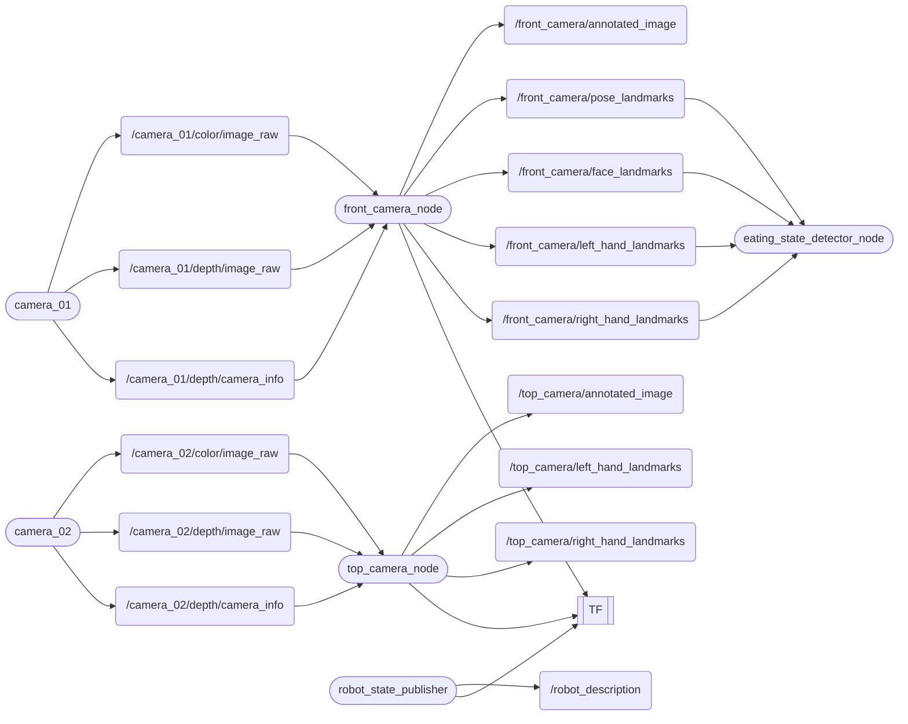

# cibo（ちーぼ）
[](https://docs.ros.org/en/humble/)

🚀 きのう
- たべているときの「ひとのほねのうごき（すがた）」をよみとります
- しょくじちゅうの「いまのようす（じょうたい）」をよみとります

## 📦 できること
ノード（めいれい）とトピック（やりとりするじょうほう）


## 🛠️ じゅんび（セットアップ）
### カメラのせってい
リンクのあんないにしたがってください↓  
[OrbbecSDK_ROS2](https://github.com/orbbec/OrbbecSDK_ROS2.git)
> [!IMPORTANT]
> つかう枝：main  
> `v2-main` 枝さんではなく，`main` 枝さんをつかいましょう  
> 2025-10-14 のじょうほうです

### ひつようなめいれいをいれる
ヘビさん :snake: のプログラムをいれる
```bash
pip3 install -U "numpy==1.26.4" "opencv-python==4.10.0.84"
pip3 install opencv-python mediapipe
```
ロボットのめいれいをいれる
```bash
sudo apt install ros-humble-cv-bridge
sudo apt install ros-humble-image-transport
sudo apt install ros-humble-message-filters
```
### ちーぼのめいれいがはいったハコ🎁をいれる
インターネットからとってくる
```bash
$ cd ~/ros2_ws/src
$ git clone https://github.com/iHaruruki/cibo.git
```
ビルド（つくる）
```bash
$ cd ~/ros2_ws
$ colcon build --symlink-install --packages-select cibo
$ source install/setup.bash
```

## 🎮 つかいかた
### Fetch（あたらしいハコ🎁をうけとる）
GitHub があたらしくなっているかもしれません．  
じぶんのパソコンであたらしいハコ🎁をうけとりましょう．
```bash
cd ~/ros2_ws/src/cibo
```
```bash
git fetch
git switch feature-nuc36
git pull origin feature-nuc36
```
### Build（つくる）
```bash
cd ~/ros2_ws
colcon build --symlink-install --packages-select cibo
source install/setup.bash
```

### カメラをうごかす
カメラきどう
```bash
ros2 launch orbbec_camera multi_camera.launch.py
```
カメラのせつぞくをかくにん
```bash
ros2 launch cibo rviz.launch.py
```
えいぞうをみる  

- `Front_camera` まどに まえカメラ のえいぞうが出ていますか？
- `Top_camera` まどに うえカメラ のえいぞうが出ていますか？

> [!TIP]  
> もし ふたつのカメラのいち（まえ／うえ）がぎゃくになったり，つながらないときはせつめいをよんでなおしてください  
> [Multi-Camera](https://github.com/orbbec/OrbbecSDK_ROS2/tree/main?tab=readme-ov-file#multi-camera)  


カメラのいりぐち `usb_port` をしるには，カメラとパソコンをつないで，つぎの文字をにゅうりょくします
```bash
ros2 run orbbec_camera list_devices_node
```
けっか（usb port 結果が表示される）
```bash
ros2 run orbbec_camera list_devices_node 
[10/14 22:55:59.986415][info][7139][Context.cpp:68] Context created with config: default config!
[10/14 22:55:59.986426][info][7139][Context.cpp:73] Work directory=/home/#######/ros2_ws, SDK version=v1.10.27-20250925-0549823
[10/14 22:55:59.986459][info][7139][LinuxPal.cpp:32] createObPal: create LinuxPal!
[10/14 22:56:00.340029][warning][7139][OpenNIDeviceInfo.cpp:190] New openni device matched.
[10/14 22:56:00.340040][warning][7139][OpenNIDeviceInfo.cpp:190] New openni device matched.
[10/14 22:56:00.340145][info][7139][LinuxPal.cpp:166] Create PollingDeviceWatcher!
[10/14 22:56:00.340186][info][7139][DeviceManager.cpp:15] Current found device(s): (2)
[10/14 22:56:00.340190][info][7139][DeviceManager.cpp:24] 	- Name: SV1301S_U3, PID: 0x0614, SN/ID: , Connection: USB3.0
[10/14 22:56:00.340192][info][7139][DeviceManager.cpp:24] 	- Name: SV1301S_U3, PID: 0x0614, SN/ID: , Connection: USB3.0
[INFO] [1760450160.382261914] [list_device_node]: serial: AY0F7010783
[INFO] [1760450160.382286638] [list_device_node]: usb port: 2-3.2 
[INFO] [1760450160.424122696] [list_device_node]: serial: AY0F7010108
[INFO] [1760450160.424135464] [list_device_node]: usb port: 2-4.2
```
- つぎにカメラのせっていをへんこうします  
`ros2_ws/src/OrbbecSDK_ROS2/orbbec_camera/launch/multi_camera.launch.py`
```python
from launch import LaunchDescription
from launch.actions import DeclareLaunchArgument, IncludeLaunchDescription, GroupAction, ExecuteProcess
from launch.launch_description_sources import PythonLaunchDescriptionSource
from launch_ros.actions import Node
from ament_index_python.packages import get_package_share_directory
import os


def generate_launch_description():
    # Include launch files
    package_dir = get_package_share_directory('orbbec_camera')
    launch_file_dir = os.path.join(package_dir, 'launch')
    launch1_include = IncludeLaunchDescription(
        PythonLaunchDescriptionSource(
            os.path.join(launch_file_dir, 'astra_stereo_u3.launch.py')  # replace your camera launch file
        ),
        launch_arguments={
            'camera_name': 'camera_01',
            'usb_port': '2-3.2',    # まえのカメラ
            'device_num': '2',
            'sync_mode': 'standalone'
        }.items()
    )

    launch2_include = IncludeLaunchDescription(
        PythonLaunchDescriptionSource(
            os.path.join(launch_file_dir, 'astra_stereo_u3.launch.py')  # replace your camera launch file
        ),
        launch_arguments={
            'camera_name': 'camera_02',
            'usb_port': '2-4.2',    # うえのカメラ
            'device_num': '2',
            'sync_mode': 'standalone'
        }.items()
    )

    # If you need more cameras, just add more launch_include here, and change the usb_port and device_num

    # Launch description
    ld = LaunchDescription([
        GroupAction([launch1_include]),
        GroupAction([launch2_include]),
    ])

    return ld
```
- ビルド（つくる）
```bash
colcon build --symlink-install --packages-select orbbec_camera
```
- カメラがうごくか もういちど かくにん  
[Run camera](#Camera-launch)

### ちーぼをうごかす
```bash
ros2 launch cibo cibo_depth.launch.py
```
ROI（見てほしいはんい）のえらびかた（ほねのいちをかんがえます）
1. ちーぼをきどうするとどうがのまどがでます
2. まうすで どらっぐして はんいをえらびます
3. けっていすると「みどり」のしかくが出ます

### 出力のがぞうをみる
```bash
ros2 run cibo image_show_node
```
### そしゃくかいすう（かみかみのかいすうをかぞえます）
```bash
ros2 run cibo chew_counter_node
```
> [!WARNING]
> ただいま ちょうせいちゅうです  
> うまく うごかないことがあります

### たべている人のじょうたいをかんがえる
```bash
ros2 run cibo eating_state_detector_node
```
> [!WARNING]
> ただいま ちょうせいちゅうです  
> うまく うごかないことがあります

## 🚀 めいれい
### front_camera_node
- **きのう**: まえカメラで，かおやからだの らんどまーく（めじるし）を出します

### top_camera_node  
- **きのう**: うえカメラで，からだ（ぽーず）と ての らんどまーくを出します

### chew_counter_node
- **きのう**: そしゃく（かむ）かいすうを かぞえます

## eating_state_detection
**きのう**: たべている・しゃべっている・じっとしている などの「じょうたい」をよみとります